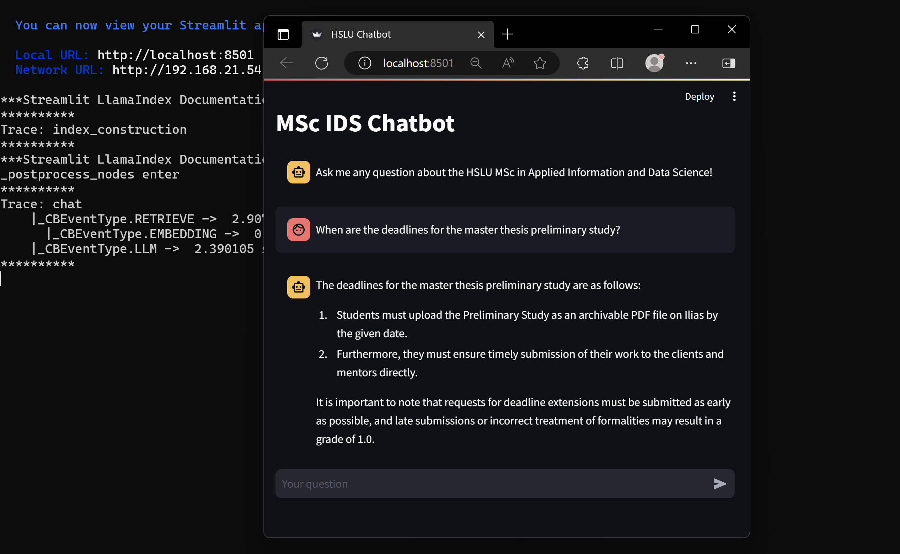

# 🤖 RAG Chatbot

**Authors:** Daniel Herrera, Rodrigo González, Víctor Antón & Chris Imholz

**Date:** 30/04/2024

---

## 1. Project Overview

The "RAG Chatbot" is an advanced Retrieval-Augmented Generation (RAG) chatbot application built using the Python-based LlamaIndex framework. This chatbot is designed to assist students by providing answers and guidance based on a comprehensive set of school-relevant data and documentation. Leveraging cutting-edge natural language processing (NLP) techniques, the chatbot ensures accurate and contextually appropriate responses, making it a valuable tool for educational support.

This project is maintained within a GitHub repository, facilitating collaboration and ensuring reproducibility across various development environments.

## 2. Repository Structure:

- 📁 `.idea`: Configuration files for the development environment, useful for maintaining consistent settings across different contributors' setups.
- 📁 `__pycache__`: Compiled Python files to improve the execution speed of the code.
- 📁 `assets`: Some additional files for representation and readme file.
- 📁 `GEN02`: Contains generated files or output relevant to the project's execution, including intermediate results and cached data.
- 📁 `data`: Holds datasets and school-related documentation that the chatbot uses to generate responses.
- 📁 `module_descriptions`: Includes descriptions of university modules, used to augment the responses.
- 📄 `.env`: Environment configuration file storing sensitive information like API keys and environment variables necessary for running the chatbot.
- 📄 `.gitattributes`: Git attributes file managing how different file types are handled within the repository, ensuring proper handling of line endings, binary files, etc.
- 📄 `main.py`: The main Python script that initializes and runs the chatbot application.
- 📄 `note_engine.py`: Script responsible for the note generation agent, which saves information returned by the chatbot.
- 📄 `pdf.py`: Script dedicated to handling PDF files, for extracting and processing information relevant to the chatbot’s responses.
- 📄 `prompts.py`: Script containing the prompts or initial configurations used to guide the chatbot's response generation.

## 3. Additional Notes

- 📂 Working Directory: The working directory is configured to align with the location of the `main.py` script, ensuring that all file paths and imports are correctly referenced throughout the project.
- 🔄 Data Handling: The Python code automatically processes and utilizes the data from the `data` folder, focusing on content relevant to educational support, which informs the chatbot's responses.
- 🌐 API Integration: The `.env` file contains API keys for any external data sources, allowing the chatbot to access and incorporate up-to-date information as needed.
